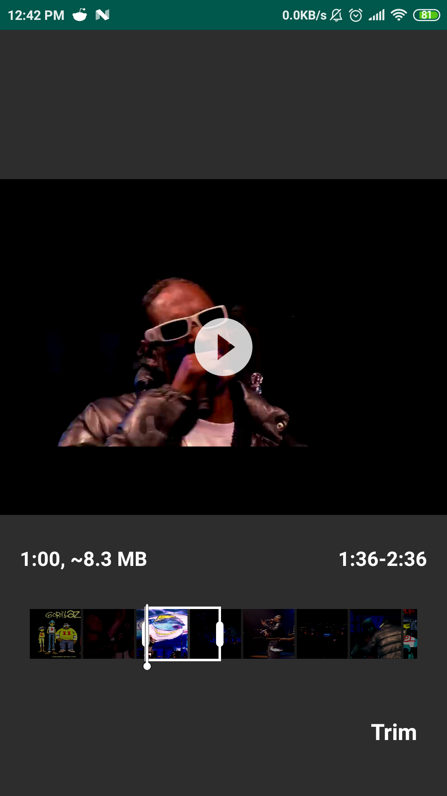

#### Video Trimmer  
Try making video trimmer like on WhatsApp, based on [Telegram Android](https://github.com/DrKLO/Telegram) Source Code  
Using MediaCodec and MP4 Parser 1.0.6  
 
  

#### Additional Features
- Min & Max trim duration (modify [CustomVideoTimelinePlayView](https://github.com/illwiz/video-trimmer/blob/master/trimmer-telegram/src/main/java/org/telegram/messenger/CustomVideoTimelinePlayView.java) minProgressDiff & maxProgressDif)
- Max trim size (use [CustomVideoTimelinePlayView](https://github.com/illwiz/video-trimmer/blob/master/trimmer-telegram/src/main/java/org/telegram/messenger/CustomVideoTimelinePlayView.java).setMaxVideoSize())
- Convert video (modify VideoEditInfo.COMPRESS_XXX on [TrimUtils](https://github.com/illwiz/video-trimmer/blob/master/app/src/main/java/dev/illwiz/videotrimmer/utils/TrimUtils.java))
